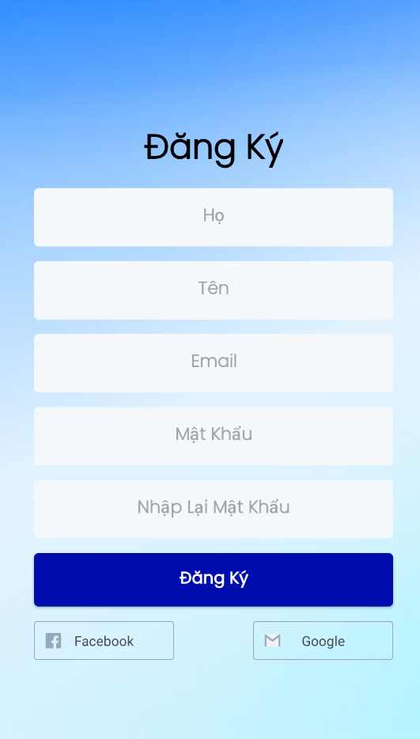
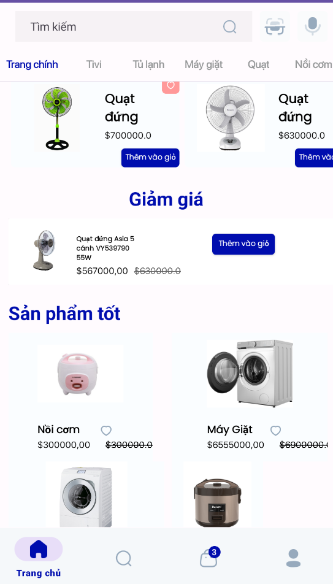
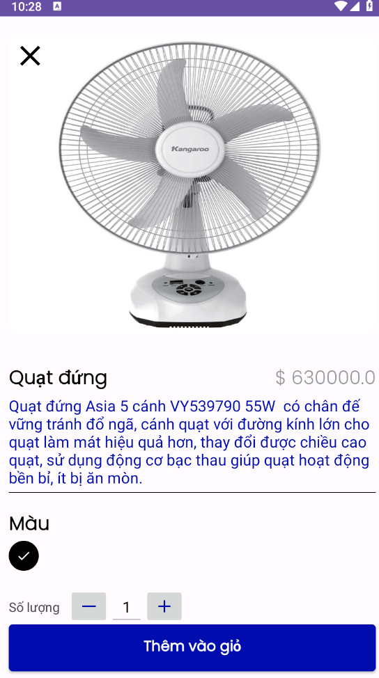
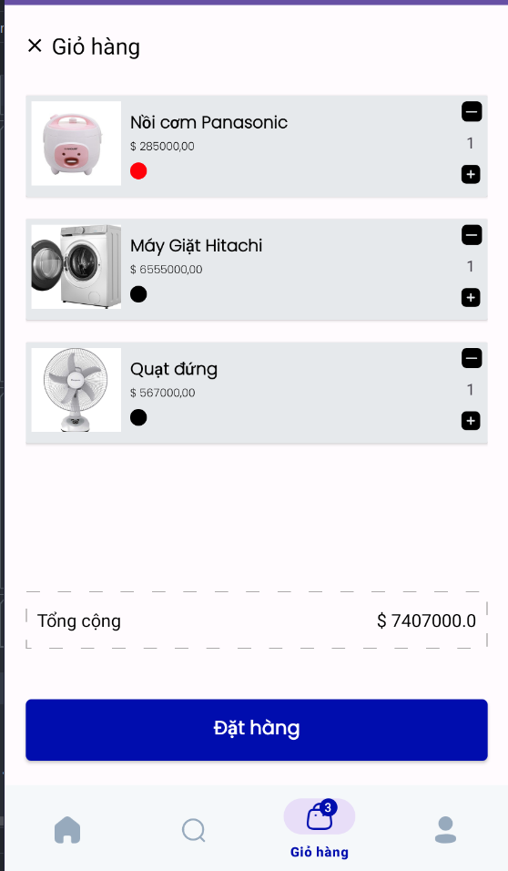
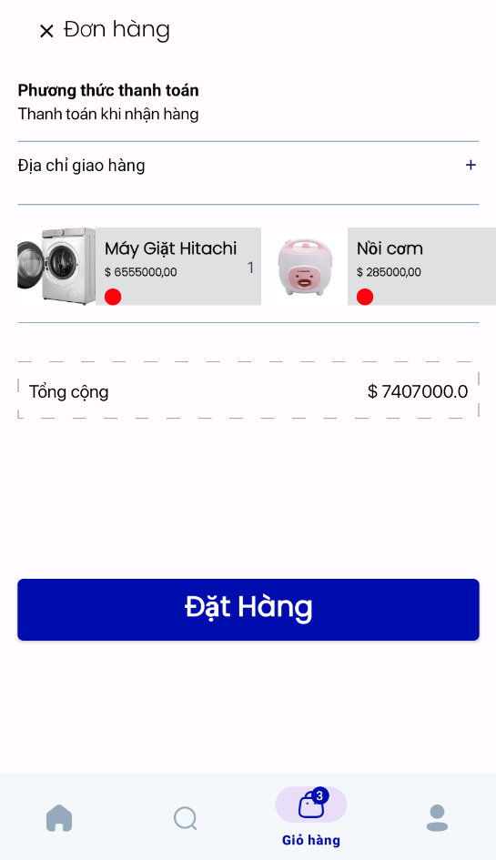

# Modern_Android_E-commerce_App

<h3>Công nghệ sử dụng</h3>
<b>App: </b> Kotlin, MVVM Architecture, Firebase, Hilt, View Binding,
Navigation, ViewPager
 
<b>Database: </b> Firebase

<h3>Giao diện App</h3>

<h5>Giao diện trang đăng nhập</h5>

<h5>Giao diện trang đăng kí</h5>

<h5>Giao diện trang chủ</h5>

<h5>Giao diện trang sản phẩm</h5>

<h5>Giao diện trang giỏ hàng</h5>

<h5>Giao diện trang đặt hàng</h5>

